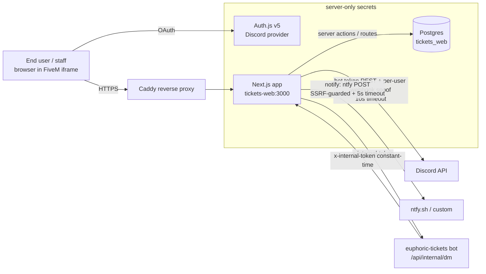
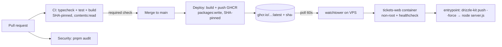
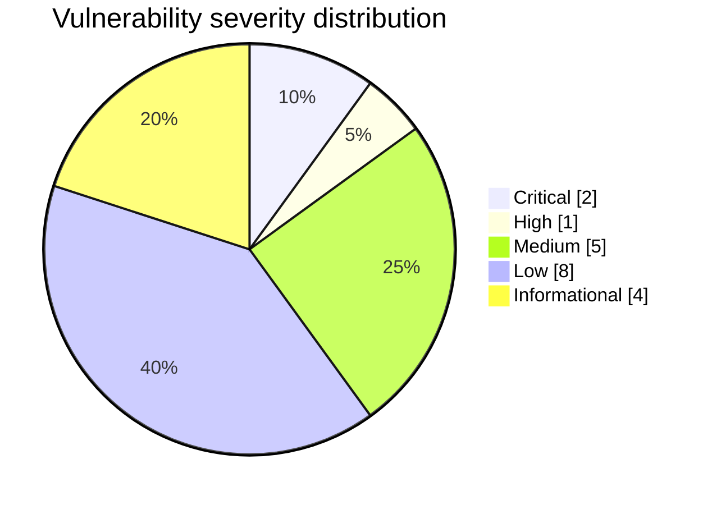

# Security Review — euphoric-tickets-web

- **Repo:** `jason-tucker/euphoric-tickets-web`
- **Base commit:** `a7c6031` (v0.9.3)
- **Review branch:** `ai/security-optimization-review/20260609-a7c6031`
- **Release after fixes:** v0.10.0
- **Reviewer:** automated multi-agent review (repo mapping, threat model, secrets, deps, AppSec, infra, CI/CD).
- **Date:** 2026-06-09

## Executive summary

This is a **well-engineered** Next.js 15 (App Router) + Auth.js v5 + Drizzle/Postgres
multi-tenant app, embedded in a FiveM CEF phone iframe. It is **not** the rushed
"vibe-coded" codebase the brief assumed: every protected route and server action
calls a real guard (`requireSession` / `requireBusinessAccess` / `requireSudo`),
input is validated with Zod throughout, tenant isolation is enforced by
`businessId`/ownership predicates on every query, no secrets are committed, and
the markdown renderer builds React nodes (no `dangerouslySetInnerHTML`).

The highest-impact issue was **dependency drift**: `next@15.1.4` sat behind a
large advisory set — two **Critical** (React-flight RCE `<15.1.9`; **middleware
authorization bypass CVE-2025-29927** `<15.2.3`), plus High SSRF/DoS and App
Router XSS. Upgrading to **next@15.5.19** clears 26 of 28 advisories. The
remaining real issues were a **blind SSRF** via a user-supplied custom ntfy
server URL, **missing timeouts** on all outbound Discord/notification calls, a
**root** container, a **weak default DB password**, and **unpinned** CI actions.

**Overall risk rating:** was **High** (driven by the outdated framework with two
criticals); **after fixes: Low**.

**Safe to deploy?** Yes, with two operator prerequisites (see
`DEPLOYMENT_AND_ROLLBACK.md`): (1) set `POSTGRES_PASSWORD` in `.env` (the split
compose no longer has a weak default), and (2) rebuild the image so the
non-root + healthcheck Dockerfile takes effect. Verified locally with
`pnpm typecheck`, `pnpm test` (13/13), and `pnpm build` (all green).

### Biggest fixed issues
1. Next.js upgraded `15.1.4 → 15.5.19` — clears 2 Critical + 8 High + 14 Moderate + 4 Low advisories (audit 28 → 1, the last being build-time-only).
2. Blind SSRF on the user-controlled `ntfyServer` notification URL — added an allow/deny guard (`src/lib/ssrf.ts`) with private/reserved-IP blocking + DNS resolution + request timeout.
3. Unbounded outbound calls — every Discord REST call and notification POST now has a 5–10s `AbortSignal` timeout.
4. Container hardening — runs as non-root `node`, with a `HEALTHCHECK`.
5. CI/CD supply chain — all GitHub Actions pinned to commit SHAs; least-privilege `permissions`; a real `pnpm test` gate; a `pnpm audit` security workflow.

### Biggest remaining risks (manual)
- **watchtower** mounts the Docker socket from an unpinned `:latest` fork image — pin by digest / consider a socket-proxy (documented).
- **`drizzle-kit push --force`** auto-applies schema diffs to the live DB on every boot (by design; blast-radius noted).
- Build-time-only `esbuild` advisory (transitive via `drizzle-kit`) — no runtime exposure.
- Repo-level controls only the owner can set: branch protection requiring the CI check, GitHub secret scanning, and (if public/GHAS) CodeQL.

## Coverage

| Area | Status | Notes / Evidence |
|---|---|---|
| Repo mapping / inventory | completed | Routes, actions, schema, infra all enumerated |
| Threat model | completed | `THREAT_MODEL.md` |
| Secrets (tree + recent history) | completed | None found; `.gitignore`/`.dockerignore` secret-aware |
| Dependencies / advisories | completed | `pnpm audit`; `DEPENDENCY_AND_SBOM_NOTES.md` |
| AuthN / AuthZ / tenant isolation | completed | Strong; no IDOR/bypass found |
| Static AppSec (inj/XSS/SSRF/redirect) | completed | One real SSRF fixed; XSS surface safe |
| AI / LLM / RAG / agent safety | completed (N/A) | No AI surface — `AI_SAFETY_REVIEW.md` |
| Infra / Docker / compose | completed | Non-root + healthcheck + compose hardening |
| CI/CD | completed | SHA-pinned, permissions, test gate, audit job |
| DB / data safety | completed | Scoped queries, RESTRICT FKs; push-based schema noted |
| Observability / reliability | partial | Timeouts added; metrics/tracing out of scope |
| SBOM generation | not executed | No syft/trivy in env — documented as follow-up |
| DAST / staging deploy | not executed | App needs Discord OAuth + Postgres + bot token; no staging target provided (UNSPECIFIED) |

## Findings register

Severity = worst-case impact; Confidence = certainty it is real.

| ID | Sev | Conf | Category (CWE/OWASP) | Location | Impact | Fix | Test | Status |
|---|---|---|---|---|---|---|---|---|
| F-01 | Critical | High | Vuln dep — Auth bypass (CVE-2025-29927) | `next@15.1.4` | Middleware-based authz could be bypassed (here middleware is only a cosmetic pre-redirect; real authz is server-side, limiting impact) | Upgrade `next→15.5.19` | `pnpm audit`, build | Fixed |
| F-02 | Critical | High | Vuln dep — RCE in React flight (CWE-502) | `next<15.1.9` | Potential RCE via crafted flight payloads | Upgrade `next→15.5.19` | `pnpm audit` | Fixed |
| F-03 | High | High | Vuln dep — SSRF/DoS/XSS cluster | `next<15.5.16` | SSRF, cache poisoning, App Router XSS, Server Actions source exposure, DoS | Upgrade `next→15.5.19` | `pnpm audit` | Fixed |
| F-04 | Medium | High | SSRF (CWE-918, OWASP A10) | `src/server/notify.ts` `postNtfy` | User-set `ntfyServer` URL POSTed server-side → blind SSRF to internal/metadata hosts | `src/lib/ssrf.ts` `assertPublicHttpUrl` (deny private/reserved IPs + DNS resolve) + timeout | `src/lib/ssrf.test.ts` (13) | Fixed |
| F-05 | Medium | High | Reliability / DoS (CWE-400) | `src/lib/discord.ts`, `src/server/notify.ts` | No timeout on ~20 outbound calls → a hung peer pins a server action | `discordFetch` + `AbortSignal.timeout` (10s Discord / 5s notify) | typecheck/build | Fixed |
| F-06 | Medium | High | Container runs as root (CWE-250) | `Dockerfile` | Compromise of the web process = root in container | `USER node` + `chown` + `HEALTHCHECK` | build (image build manual) | Fixed |
| F-07 | Medium | Med | Weak default credential (CWE-1188/798) | `docker-compose.yml` | `POSTGRES_PASSWORD` silently defaulted to `tickets_web_dev` | Require the var (`:?`) — **breaking, see deploy doc** | n/a | Fixed (documented) |
| F-08 | Medium | Med | Supply chain — Docker socket (CWE-250) | `docker-compose*.yml` watchtower | Unpinned `:latest` fork with `docker.sock` = host control | Added `no-new-privileges` to combined; digest-pin documented | n/a | Partially mitigated |
| F-09 | Low | High | Supply chain — unpinned actions (CWE-1357) | `.github/workflows/*` | Retargeted action tag could alter CI/deploy | SHA-pinned all actions (ci/deploy/security) | n/a | Fixed |
| F-10 | Low | High | CI least-privilege (CWE-272) | `.github/workflows/ci.yml` | No explicit `permissions` block | Added `permissions: contents: read` | n/a | Fixed |
| F-11 | Low | Med | Missing CI gates | `.github/workflows` | No test/dep-scan gate | Added `pnpm test` gate + `security.yml` audit | CI | Fixed |
| F-12 | Low | High | Timing side-channel (CWE-208) | `src/app/api/internal/notify/route.ts` | `!==` token compare not constant-time; minimal validation | `timingSafeEqual` + Zod schema | typecheck/build | Fixed |
| F-13 | Low | Med | Missing input validation | `src/app/api/discord/[guildId]/members/route.ts` | Unbounded `q` search param | Clamp to 100 chars | typecheck | Fixed |
| F-14 | Low | Med | Missing input validation | `src/app/admin/bot/actions.ts` | `guildId` unvalidated (sudo-only) | `^\d{17,20}$` guard | typecheck | Fixed |
| F-15 | Low | Med | Missing input validation | `src/app/b/[slug]/settings/actions.ts` | `categoryId` unvalidated (already scoped) | UUID guard | typecheck | Fixed |
| F-16 | Low | Med | Open-redirect robustness (CWE-601) | `src/app/demo/persona/route.ts` | `startsWith('/demo')` allowed `/demoX` | Require `/demo` or `/demo/` boundary | typecheck | Fixed |
| F-17 | Low | High | SSRF defense-in-depth (save-time) | `src/app/settings/notifications/actions.ts` | Weak `^https?://` check on `ntfyServer` | `parseSafeHttpUrl` structural reject | `ssrf.test.ts` | Fixed |
| F-18 | Low | High | Privacy — viewer IP leak (CWE-200) | `src/components/app/discord-markdown.tsx` | Inline `` from arbitrary http(s) in ticket text leaks staff IP to attacker host | Documented; mirrors Discord behaviour — no change | n/a | Accepted |
| F-19 | Info | High | Build-time vuln dep | `esbuild` (via `drizzle-kit`) | Dev-server SSRF; no runtime/prod exposure | Documented residual | n/a | Accepted |
| F-20 | Info | High | Trust boundary (by design) | `src/server/auth.ts` | 10-min stale guild snapshot | Documented; fail-safe redirect on miss | n/a | Accepted |
| F-21 | Info | Med | Destructive ops script | `scripts/euphoric-tickets-web` | `update` does `git reset --hard` | Documented (ops convenience script) | n/a | Accepted |
| F-22 | Info | High | Schema auto-apply (by design) | `scripts/docker-entrypoint.sh` | `drizzle-kit push --force` each boot | Documented blast-radius | n/a | Accepted |

## Changes made (by area)

- **Dependencies:** `next 15.1.4→15.5.19`, `eslint-config-next 15.1.4→15.5.19`, `next-auth 5.0.0-beta.25→beta.30`, `postcss ^8.5.0→^8.5.10` + a `pnpm.overrides` dedupe to `>=8.5.10`; added `vitest`.
- **AppSec:** new `src/lib/ssrf.ts` guard; SSRF + timeout on `notify.ts`; timeout wrapper across `discord.ts`; constant-time token + Zod on `internal/notify`; input clamps/validators on members route, `leaveGuildAction`, `deleteCategoryAction`, `notifications` action; tightened `/demo/persona` redirect.
- **Infra:** `Dockerfile` non-root `node` + `HEALTHCHECK`; `docker-compose.yml` requires `POSTGRES_PASSWORD` + `no-new-privileges` on web/db; `docker-compose.combined.yml` `no-new-privileges` on watchtower.
- **CI/CD:** SHA-pinned actions in `ci.yml`/`deploy.yml`; `permissions: contents: read`; `pnpm test` gate; new `security.yml` (`pnpm audit`).
- **Tests:** `vitest.config.ts` + `src/lib/ssrf.test.ts` (13 cases).
- **Docs:** this folder + `CHANGELOG.md` (v0.10.0).

## Tests run

| Command | Result | Notes |
|---|---|---|
| `pnpm install` | pass | lockfile updated for upgrades + vitest |
| `pnpm typecheck` (`tsc --noEmit`) | pass | clean before & after all changes |
| `pnpm test` (`vitest run`) | pass | 13/13 in `ssrf.test.ts` |
| `pnpm build` (`next build`) | pass | verified on `next@15.5.19` |
| `pnpm audit` | 28 → 1 | only build-time `esbuild` (moderate) remains |
| `pnpm lint` | not run | `next lint` is unconfigured/interactive (no ESLint config); documented |

## Deployment status

**Not deployed.** No staging target was provided (UNSPECIFIED) and the app
requires live Discord OAuth + Postgres + bot token to run end-to-end, which this
container cannot supply. Changes are committed to the review branch for PR
review. Rollback = revert the PR / redeploy the previous GHCR image digest. See
`DEPLOYMENT_AND_ROLLBACK.md`.

## Remaining manual actions

1. **Set `POSTGRES_PASSWORD`** in the split-compose `.env` (no more weak default) — for an existing volume, set it to the current password first, then rotate (`DEPLOYMENT_AND_ROLLBACK.md`).
2. **Pin watchtower** by digest (or adopt a docker-socket-proxy); optionally pin base images (`node:24-alpine`, `postgres:16-alpine`) by digest.
3. **Branch protection:** require the `CI` check before merge to `main`.
4. **Enable GitHub secret scanning + push protection**; if the repo is public or has Advanced Security, enable CodeQL default setup (SAST on top of `pnpm audit`).
5. **Rotate** `AUTH_SECRET` / `DISCORD_BOT_TOKEN` / `AUTH_DISCORD_SECRET` only if ever exposed (none found committed — no rotation strictly required).
6. Review the `next-auth` beta.30 bump and the (documented) breaking compose change before deploying.

## Diagrams

### System / data flow

### Deployment pipeline

### Severity distribution (findings)

